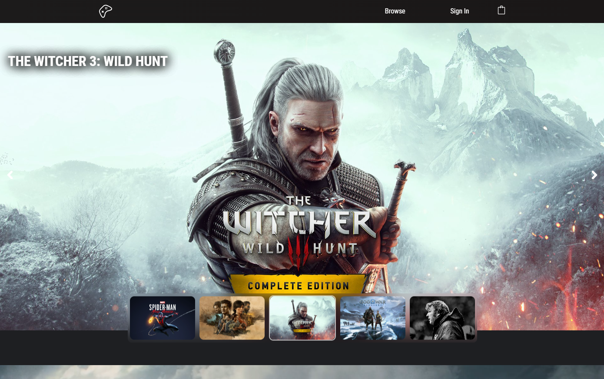
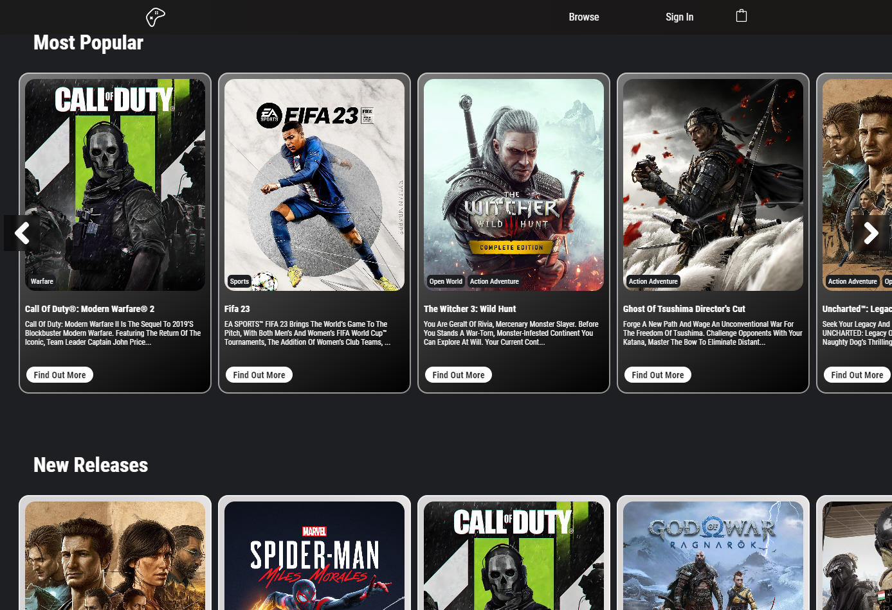
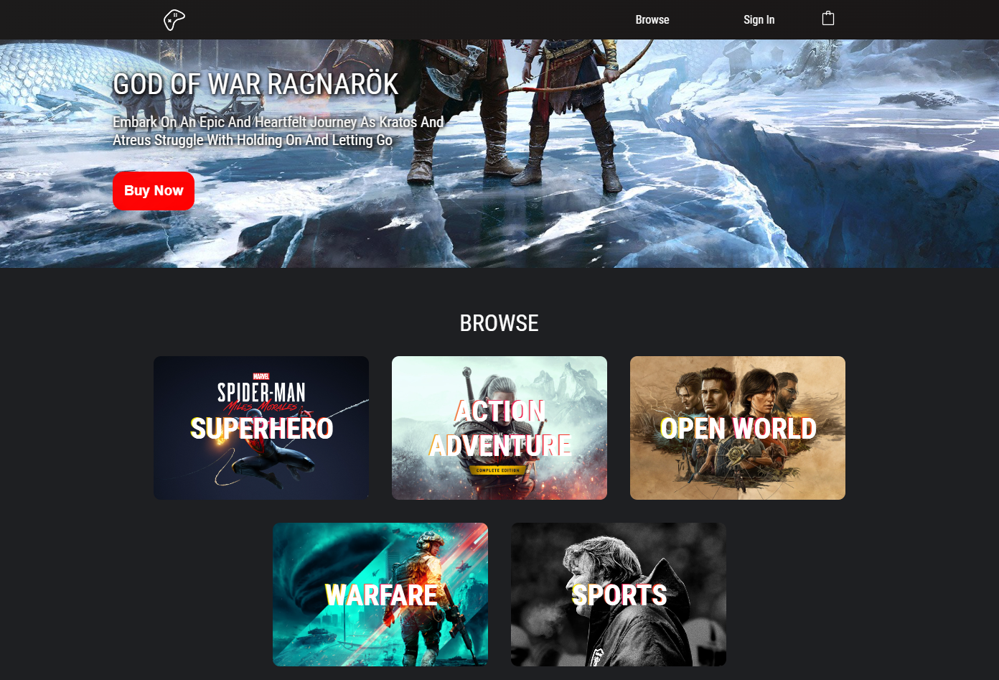

# [GreatGames E-Commerce Website](https://better-lamb-dungarees.cyclic.app/)

 

## The Idea
A `Fully Responsive` & `Interactive` `Full-Stack Website` that is consisted of a `React.js` frontend and a `Node.js` + `Express.js` backend, fetching data from a `MongoDB` Database. `JSONWebToken`, `bcrypt` & `passport.js` are used to authenticate users on the backend while `React Redux` is used to keep users Signed-In on the frontend. `Stripe` is used to seamlessly handle transactions. The Admin of the website has a special Sign-In status that grants them access to the **Admin Page** which manages products on the website.

### [Visit the Live Site](https://better-lamb-dungarees.cyclic.app/) 👈

## Technologies Used
`Node.js` `Express.js` `React.js` `MongoDB` `React Redux` `ReduxToolkit` `Async Thunk` `Stripe` `JSONWebToken` `bcrypt` `passport.js` `React Router` `React Toastify` `Sass` `GIT`

 

